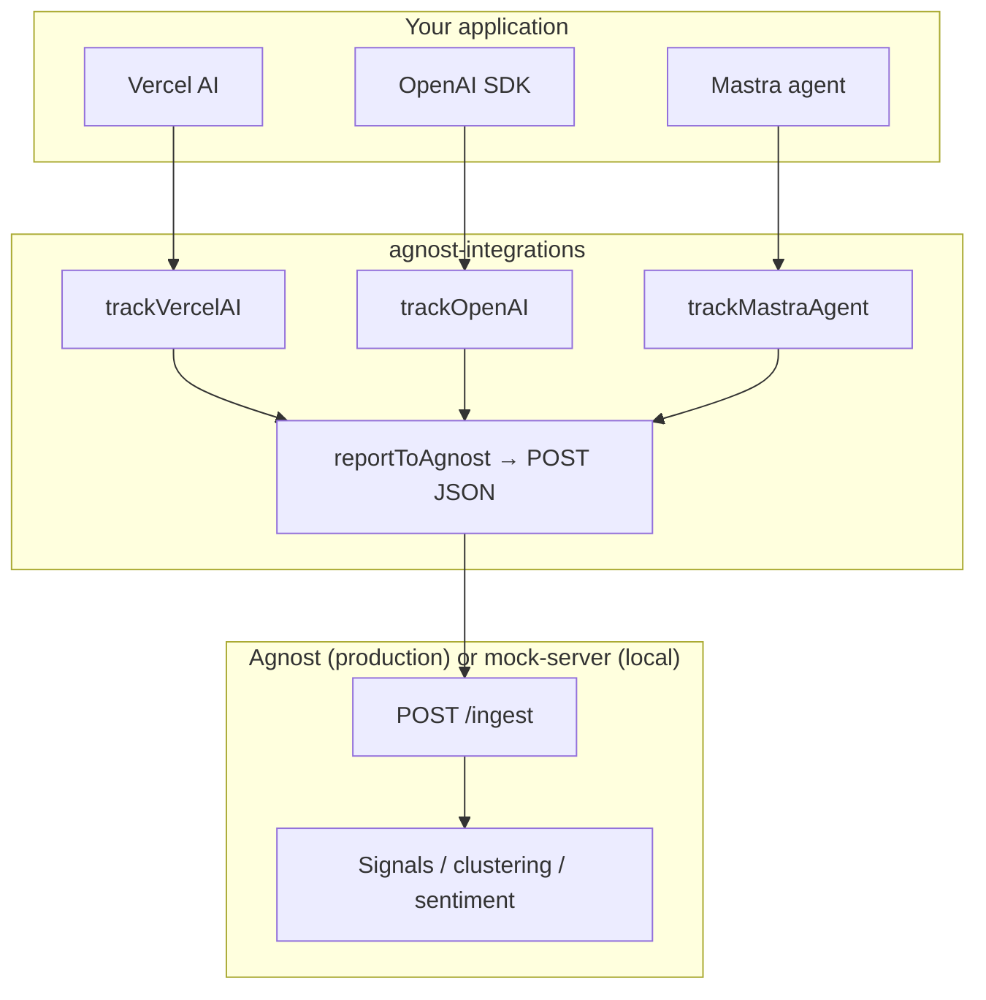

# agnost-integrations

**Track B submission** — drop-in telemetry for [Agnost](https://agnost.ai/) from **Vercel AI**, **OpenAI**, and **Mastra** agents.

Full design rationale: **[REASONING.md](./REASONING.md)**  

## System overview



> **Submission note:** Paste a screenshot of this diagram (or your own) into `REASONING.md` §12 before sending.

## Supported SDKs

| SDK | Function | Coverage |
|-----|----------|----------|
| Vercel AI SDK | `trackVercelAI()` | `generateText`, `streamText` |
| OpenAI SDK | `trackOpenAI()` | Chat completions |
| Mastra | `trackMastraAgent()` | `agent.generate()` |

## Quick start

**Terminal 1 — mock ingest API**

```bash
npm install
npm run build
npm run mock-server
```

**Terminal 2 — run demos (mock LLM, no API key)**

```bash
npm run example
curl http://localhost:3000/events
```

**With real OpenAI**

```bash
export USE_OPENAI=true
export OPENAI_API_KEY=sk-...
npm run example
```

## Usage

### Config

```ts
const config = {
  orgId: process.env.AGNOST_ORG_ID ?? 'your-org',
  endpoint: process.env.AGNOST_ENDPOINT ?? 'https://api.agnost.ai/ingest',
};
```

### Vercel AI SDK

```ts
import { trackVercelAI } from 'agnost-integrations';

const { generateText, streamText } = trackVercelAI(config);

const result = await generateText({
  model,
  messages: [{ role: 'user', content: 'Hello' }],
});
```

### OpenAI SDK

```ts
import { trackOpenAI } from 'agnost-integrations';

const openai = trackOpenAI(config);
const result = await openai.chatCompletionsCreate({
  model: 'gpt-4o',
  messages: [{ role: 'user', content: 'Hello' }],
});
```

### Mastra

```ts
import { trackMastraAgent } from 'agnost-integrations';

const agent = trackMastraAgent(yourMastraAgent, config);
const result = await agent.generate([{ role: 'user', content: 'Hello' }]);
```

## Event schema

```json
{
  "orgId": "string",
  "input": "string",
  "output": "string",
  "model": "string",
  "latencyMs": 123,
  "framework": "vercel-ai | openai | mastra",
  "sessionId": "optional",
  "error": "optional",
  "timestamp": "ISO-8601"
}
```

## Mock ingest API

| Route | Method | Description |
|-------|--------|-------------|
| `/ingest` | POST | Accept telemetry JSON |
| `/events?limit=50` | GET | List recent events (dev) |
| `/health` | GET | Liveness |

## Scripts

| Script | Description |
|--------|-------------|
| `npm run build` | Compile TypeScript → `dist/` |
| `npm run mock-server` | Local ingest on `:3000` |
| `npm run example` | Run all integration demos |

## Project structure

```
src/
  agnost.ts      # HTTP transport (best-effort reporting)
  utils.ts       # Input extraction + success/failure reporters
  vercel-ai.ts   # Vercel AI wrappers
  openai.ts      # OpenAI wrappers
  mastra.ts      # Mastra agent wrapper
  index.ts       # Public exports
example/test.ts  # End-to-end demos
mock-server.ts   # Demo ingest API
REASONING.md     # Track B submission write-up
```

## License

ISC
