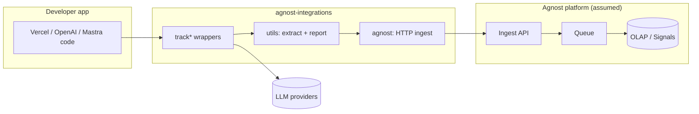
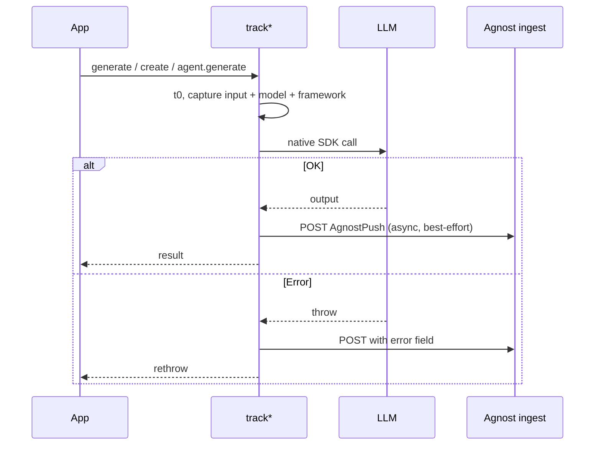
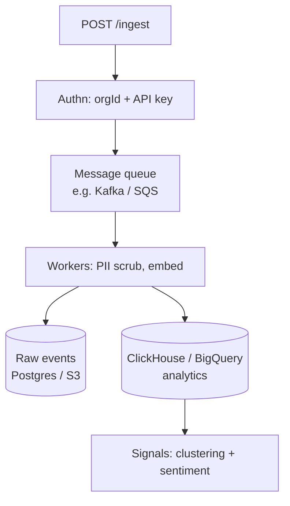
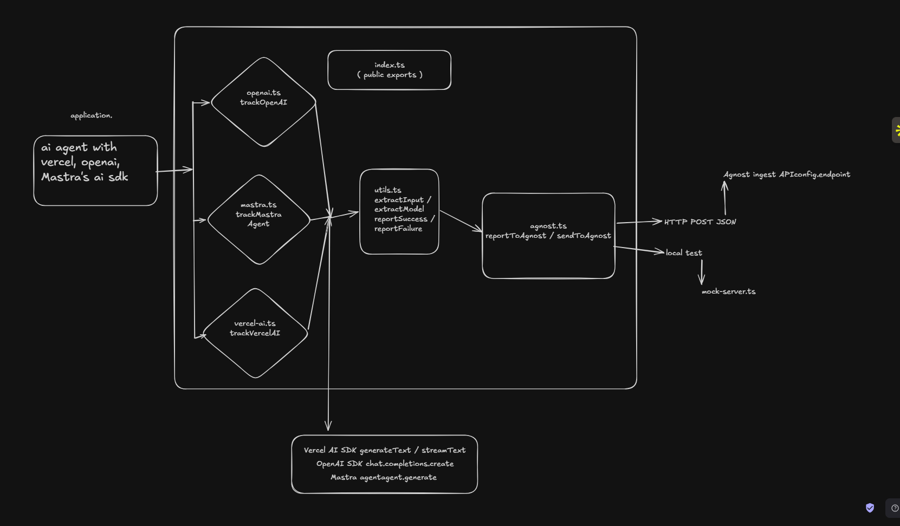

# Track B — Agnost Integration Mode

** submission:** Integration SDK for Vercel AI, OpenAI, and Mastra agents  

---

## 1. What Agnost does (and where this fits)

[Agnost](https://agnost.ai/) is a **self-improving observability layer** for conversational AI agents. It sits between your agent and product decisions:

```
Your Agent (any LLM / framework)  →  Agnost ingest  →  Signals · Evals · Improvements
```

Unlike span-only APM, Agnost cares about **intent and sentiment** aggregated across conversations (clusters like “20% of users asking for refunds due to X”). That requires reliable capture of **every user↔agent turn** with model, latency, and failure context — before clustering runs downstream.

**This repo solves the first mile:** drop-in wrappers so teams on Vercel AI, OpenAI, or Mastra send normalized events to Agnost in **&lt;5 lines**, without rewriting agents or adopting OpenTelemetry on day one.

---

## 2. Problem

Teams ship agents on different SDKs. Agnost needs the same semantic event regardless of framework:

| Need | Why |
|------|-----|
| Zero change to LLM error semantics | Observability must never break production |
| Minimal API surface | Weekend-shippable; PM/engineer can try in one sitting |
| Normalized payload | One ingest pipeline → one OLAP schema → one Signals dashboard |
| Framework-specific hooks | Streaming (`onFinish`), chat completions, agent `generate()` differ |

---

## 3. Chosen approach: **thin tracked wrappers**

Pattern: **factory + delegate**, not global monkey-patches.

```ts
const { generateText } = trackVercelAI({ orgId, endpoint });
const openai = trackOpenAI({ orgId, endpoint });
const agent = trackMastraAgent(mastraAgent, { orgId, endpoint });
```



**Why this wins for Track B**

- **Explicit opt-in** — code review shows exactly what is traced; no surprise behavior in transitive deps.
- **Type-safe** — returned objects mirror `generateText`, `chatCompletionsCreate`, `agent.generate`.
- **Best-effort reporting** — `reportToAgnost` swallows network errors; LLM exceptions still propagate.
- **One event schema** — all frameworks map to `AgnostPush` (see §5).

---

## 4. Architecture (crisp)

### 4.1 Repo modules

| Module | Responsibility |
|--------|----------------|
| `agnost.ts` | Config, `sendToAgnost`, `reportToAgnost` (never throws) |
| `utils.ts` | Input/model extraction, success/failure reporters |
| `vercel-ai.ts` | `generateText`, `streamText` (+ `onFinish` / `onError`) |
| `openai.ts` | `chat.completions.create` |
| `mastra.ts` | Patch `agent.generate` once, restore behavior on error |
| `mock-server.ts` | Demo ingest: validate, store, `GET /events` |

### 4.2 Request lifecycle (one LLM call)



### 4.3 Assumed Agnost backend (not implemented here)

For Signals/clustering to work at scale, ingest likely fans out to:



**Assumed row schema (ingest contract this SDK implements):**

```json
{
  "orgId": "string",
  "input": "string",
  "output": "string",
  "model": "string",
  "latencyMs": 123,
  "framework": "vercel-ai | openai | mastra",
  "sessionId": "optional — correlate multi-turn",
  "error": "optional",
  "timestamp": "ISO-8601"
}
```

| Store | Role | Why |
|-------|------|-----|
| **Queue** | Decouple ingest from embedding/cluster jobs | Spikes during traffic don’t drop LLM traffic |
| **Postgres (or S3)** | Durable raw events, compliance, replay | Source of truth per `orgId` |
| **OLAP (ClickHouse-class)** | Fast aggregations by `model`, `framework`, time | Powers “20% of users…” dashboards |
| **Vector index (later)** | Semantic clustering | Intent groups beyond exact string match |

This SDK intentionally **does not** pick clustering algorithms (Track A). It only guarantees **clean, timely events** for that pipeline.

---

## 5. Per-SDK design choices

### Vercel AI (`trackVercelAI`)

- Wraps `generateText` and `streamText` from the `ai` package.
- **Streaming:** report on `onFinish` / `onError`, then chain user callbacks — avoids buffering full streams in memory.
- `extractInput` handles `prompt`, `messages`, or `system` (Vercel APIs vary).
- `extractModel` supports string model ids and `{ provider, modelId }` objects.

### OpenAI (`trackOpenAI`)

- Exposes `chatCompletionsCreate` instead of proxying entire `OpenAI` client — smallest surface that covers the majority of agent chat flows.
- `trackOpenAIPrompt` for one-off scripts.

### Mastra (`trackMastraAgent`)

- Decorates `agent.generate` in place; preserves `this` binding.
- Model field = `agent.name` (Mastra agents are often named personas).

---

## 6. Minimizing friction

| Principle | Implementation |
|-----------|----------------|
| **2-minute setup** | `orgId` + `endpoint` only; matches Agnost’s positioning |
| **No refactor** | Swap `generateText` → tracked `generateText`; same params/return types |
| **Safe by default** | Reporting failures log to stderr, never throw |
| **Local proof** | `npm run mock-server` + `npm run example` — no API key required (mock model) |
| **Env-based config** | `.env.example` for `AGNOST_ORG_ID`, `AGNOST_ENDPOINT` |

**DX north star:** `npx agnost-init` (future) prints three copy-paste snippets per detected framework in `package.json`.

---

## 7. Vision: agent onboarding & distribution

**Near term (weekend → month 1)**

1. **npm package** `@agnost/integrations` with peer deps on `ai`, `openai` (optional peers — no bloat if you only use one).
2. **Vercel template** — “Deploy agent + Agnost” one-click; env vars pre-wired.
3. **Mastra plugin** — official `agnost()` middleware in their agent config when they expose a hook API.

**Medium term**

- **OpenTelemetry bridge** — export same events as OTEL spans for teams already on Honeycomb/Langfuse, while Agnost remains the intent/sentiment brain.
- **CLI `agnost doctor`** — pings ingest, validates org, runs a 1-turn mock agent.
- **Marketplace listing** — Vercel Integrations / Mastra registry entry so distribution is discovery, not docs archaeology.

**Long term**

- **Agent registry** — publish agent card + Agnost dashboard link; PMs browse live signal health before installing an agent in their product.
- **Policy-as-code** — “always report” enforced via ESLint rule or build plugin for regulated customers.

Distribution bet: **meet developers where they import** (`import { trackVercelAI } from '@agnost/integrations'`), not where they configure infra.

---

## 8. Alternatives considered & rejected

| Alternative | Why rejected |
|-------------|--------------|
| **Global monkey-patch** (`OpenAI.prototype.create = …`) | Hidden side effects, breaks with SDK updates, hard to audit |
| **OTEL-only, no wrappers** | High friction for weekend adoption; many agent apps don’t run an OTEL collector locally |
| **Proxy entire SDK instances** | Large API surface (tools, embeddings, assistants); maintenance burden |
| **Middleware in LLM provider** | Vercel AI model objects vary; doesn’t cover OpenAI/Mastra uniformly |
| **Fork / vendor SDKs** | Impossible to maintain across versions |
| **Sync blocking ingest** | Adds tail latency; violates “never break the agent” |
| **Client-side clustering** | Wrong layer; duplicates Agnost Signals; bloats bundle |

**Hybrid we’d add with a month:** OTEL exporter that emits **the same** `AgnostPush` fields as span attributes — wrappers for easy mode, OTEL for mature platforms.

---

## 9. Usable APIs in this repo

| Endpoint / API | Method | Purpose |
|----------------|--------|---------|
| `POST /ingest` | HTTP | Accept `AgnostPush` JSON (demo server) |
| `GET /events?limit=50` | HTTP | Inspect recent events (dev/debug) |
| `GET /health` | HTTP | Liveness |
| `trackVercelAI(config)` | SDK | Tracked `generateText`, `streamText` |
| `trackOpenAI(config, client?)` | SDK | Tracked chat completions |
| `trackMastraAgent(agent, config)` | SDK | Tracked `agent.generate` |
| `sendToAgnost` / `reportToAgnost` | SDK | Low-level send (strict vs best-effort) |

---

## 10. What I’d do differently with a month

| Week | Focus |
|------|--------|
| 1 | `@agnost/integrations` publish, API key auth header, retries with backoff, batching |
| 2 | `generateObject`, tool-call spans, `sessionId` from AsyncLocalStorage |
| 3 | OTEL exporter + official Agnost ingest contract from docs |
| 4 | E2E tests against real ingest; Vercel template + Mastra plugin PR |

**Quality bar upgrades:** schema versioning (`v1` envelope), redaction hooks for PII before POST, integration tests in CI, bundle size budget (&lt;5kb core).

---

## 11. How to run & verify

```bash
npm install
npm run build
npm run mock-server    # terminal 1
npm run example        # terminal 2 — mock LLM, no key
# Optional real OpenAI:
USE_OPENAI=true OPENAI_API_KEY=sk-... npm run example
```

Inspect events: `curl http://localhost:3000/events`

---

## 12. System diagram



---

*Built for Agnost Track B — integration mode, not sentiment clustering (Track A).*
